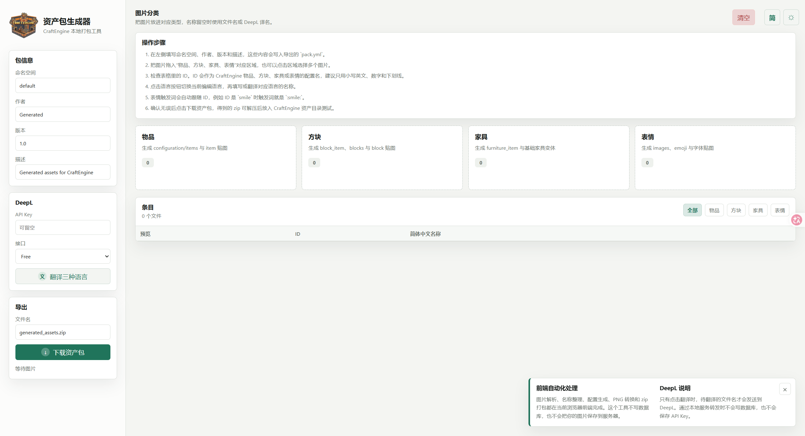

<div align="center">
  
  <h1>CraftEngine 快速打包器</h1>
  <p>快速的将按分类导入的图片转换为 CraftEngine 可识别的资源包，全流程在本地完成。</p>

  <p>
    <a href="./README_EN.md">English</a> |
    <strong>简体中文</strong>
  </p>
</div>



## 项目作用

CraftEngine 资源包生成器是一个本地网页工具，用于把图片批量生成 CraftEngine 可识别的资源包结构。你可以把图片拖入物品、方块、家具、表情等分类，编辑 ID 和显示名称，然后导出包含 CraftEngine 配置文件与 Minecraft 资源包贴图的 zip。

自动化流程都在浏览器前端完成：图片读取、ID 规范化、名称编辑、PNG 转换、配置生成和 zip 打包。本工具不写数据库，也不会把你的图片保存到服务器。

## 功能

- 生成 `pack.yml`、CraftEngine 配置文件、语言文件和资源包贴图。
- 支持 `items`、`blocks`、`furniture`、`emoji` 四类图片。
- 支持编辑简体中文、繁体中文、英文三种显示名称。
- 支持用 DeepL 补齐三种语言的空名称。
- 翻译时不会覆盖已经手动填写过的名称。
- 导出时自动把 JPG、WEBP 转换为 PNG。
- 为物品、方块、家具生成物品浏览器分类。
- 使用 CraftEngine 默认模板，例如 `default:settings/solid_1x1x1`、`default:sound/stone`、`default:loot_table/self`。
- 本地运行，不需要数据库。

## 预览


## 快速开始

### Windows

双击：

```text
启动网站.bat
```

脚本会启动本地服务并打开：

```text
http://127.0.0.1:5173
```

如果 `5173` 端口已经被旧版生成器占用，脚本会先释放端口，再启动当前版本。

### 手动启动

需要 Node.js 18 或更新版本。

```powershell
node server.js
```

然后打开：

```text
http://127.0.0.1:5173
```

## 基本流程

1. 填写命名空间、作者、版本和描述。
2. 把图片拖入物品、方块、家具或表情分类。
3. 检查每个自动生成的 ID。
4. 切换编辑语言，分别编辑 `zh_cn`、`zh_tw`、`en_us` 的显示名称。
5. 可以填写 DeepL API Key，自动翻译空名称。
6. 条目较多时，可以按类型筛选查看。
7. 下载生成的 zip，并放入带有 CraftEngine 的服务器测试。

## 生成内容

导出的 zip 包含：

```text
pack.yml
configuration/categories.yml
configuration/langs/en_us.yml
configuration/langs/zh_cn.yml
configuration/langs/zh_tw.yml
configuration/items/generated_items.yml
configuration/blocks/generated_blocks.yml
configuration/furniture/generated_furniture.yml
configuration/emoji.yml
resourcepack/assets/minecraft/textures/...
```

物品配置内的名称使用本地化键：

```yml
item_name: "<l10n:item.topaz_sword>"
```

语言文件只生成：

```text
zh_cn.yml
zh_tw.yml
en_us.yml
```

## DeepL 翻译

DeepL 是可选功能。不填写 API Key 时，空名称会使用处理后的文件名。

通过 `node server.js` 或 `启动网站.bat` 打开时，翻译请求会优先走本地 `/api/deepl` 转发，用于避免浏览器 CORS 问题。本地转发只处理当前请求，不保存 API Key。

支持的 DeepL 目标语言：

```text
ZH-HANS
ZH-HANT
EN-US
```

## CraftEngine 模板兼容

生成的方块设置会依赖 CraftEngine 默认模板。普通方块使用类似下面的模板组合：

```yml
settings:
  template:
    - default:sound/stone
    - default:hardness/stone
    - default:settings/solid_1x1x1
```

如果方块 ID 包含 `deepslate`，会使用深板岩声音与硬度模板。

`default_templates` 文件夹作为默认模板 ID 的本地参考保留。生成器本身的规则写在 `app.js` 中。

## 关于 `default_assets`

网站运行时不会读取 `default_assets`。确认生成器行为正常后，可以删除这个文件夹。网站运行需要的本地资源在 `assets` 中，CraftEngine 生成结构由 `app.js` 输出。

## 项目结构

```text
assets/                 本地 Logo 与网页资源
default_templates/      CraftEngine 默认模板参考
docs/images/            README 展示图片
templates/              未来外部模板化的说明
app.js                  前端生成逻辑
index.html              网页界面
server.js               本地静态服务与 DeepL 转发
styles.css              网页样式
启动网站.bat            Windows 启动脚本
```

## 说明

- 清空按钮需要二次确认后才会移除当前导入条目。
- 语言切换会决定名称输入框正在编辑哪个语言文件。
- 表情触发词会自动跟随 ID，例如 `smile` 会生成 `:smile:`。
- 生成的文件建议先在带有 CraftEngine 的服务器中测试，再用于正式环境。
