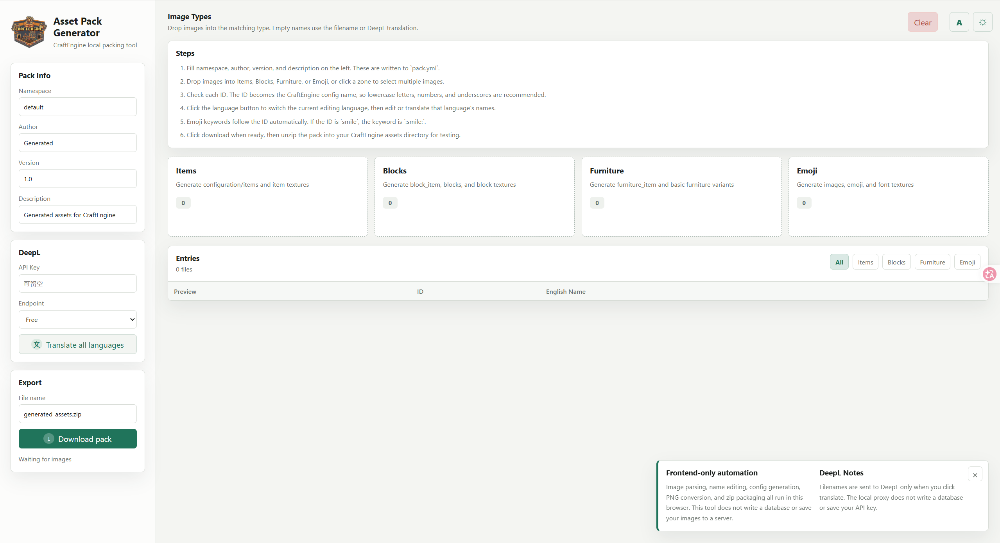
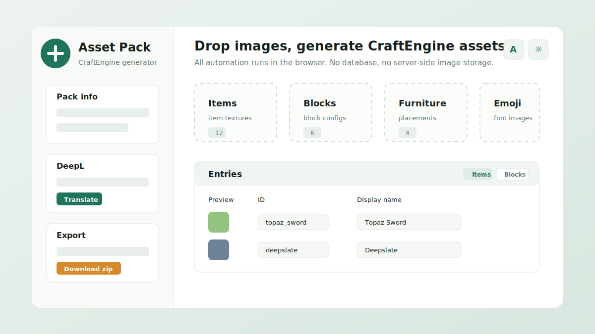
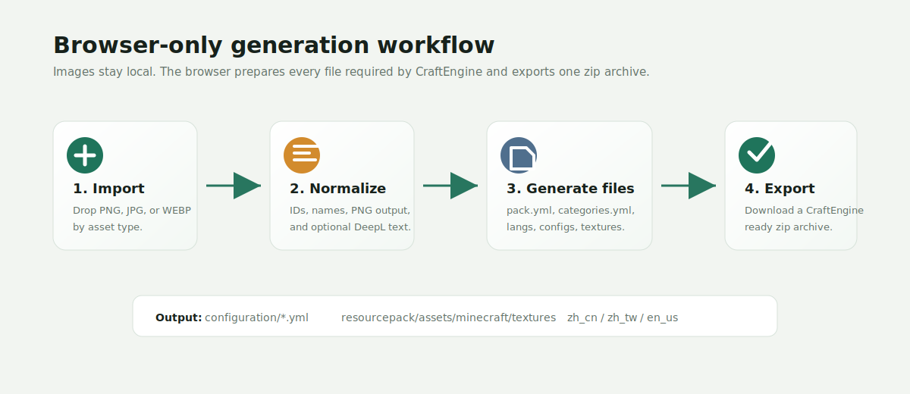

<div align="center">
  
  <h1>CraftEngine Asset Pack Generator</h1>
  <p>Generate CraftEngine-ready asset packs from categorized images, entirely in your computer.</p>

  <p>
    <strong>English</strong> |
    <a href="./README.zh-CN.md">简体中文</a>
  </p>
</div>



## What It Does

CraftEngine Asset Pack Generator is a local web tool for turning images into a CraftEngine-recognizable asset pack. Drop images into categories such as items, blocks, furniture, and emoji, edit IDs and display names, then export a zip with CraftEngine configuration files and Minecraft resource pack textures.

The whole automation pipeline runs on the frontend: image reading, ID normalization, name editing, PNG conversion, configuration generation, and zip packaging. The tool does not use a database and does not store your images on a server.

## Features

- Generate `pack.yml`, CraftEngine configuration files, language files, and resource pack textures.
- Sort images by `items`, `blocks`, `furniture`, and `emoji`.
- Edit display names in Simplified Chinese, Traditional Chinese, and English.
- Use DeepL to fill missing names for all three supported languages.
- Keep manually edited names intact during translation.
- Convert JPG and WEBP inputs to PNG when exporting.
- Generate item browser categories for items, blocks, and furniture.
- Use CraftEngine default templates such as `default:settings/solid_1x1x1`, `default:sound/stone`, and `default:loot_table/self`.
- Run locally with no database.

## Preview



## Quick Start

### Windows

Double-click:

```text
启动网站.bat
```

The script starts the local server and opens:

```text
http://127.0.0.1:5173
```

If port `5173` is already occupied by an old generator process, the script releases it before starting the current version.

### Manual Start

Requires Node.js 18 or newer.

```powershell
node server.js
```

Then open:

```text
http://127.0.0.1:5173
```

## Basic Workflow

1. Fill in namespace, author, version, and description.
2. Drop images into Items, Blocks, Furniture, or Emoji.
3. Check each generated ID.
4. Switch the editor language and edit display names for `zh_cn`, `zh_tw`, or `en_us`.
5. Optionally fill a DeepL API key and translate missing names.
6. Filter entries by type when reviewing a large list.
7. Download the generated zip and test it in a CraftEngine server.

## Generated Output

The exported zip contains:

```text
pack.yml
configuration/categories.yml
configuration/langs/en_us.yml
configuration/langs/zh_cn.yml
configuration/langs/zh_tw.yml
configuration/items/generated_items.yml
configuration/blocks/generated_blocks.yml
configuration/furniture/generated_furniture.yml
configuration/emoji.yml
resourcepack/assets/minecraft/textures/...
```

Item configuration names use localization keys like:

```yml
item_name: "<l10n:item.topaz_sword>"
```

Language files are generated for only:

```text
zh_cn.yml
zh_tw.yml
en_us.yml
```

## DeepL Translation

DeepL is optional. If no API key is provided, empty names fall back to readable filenames.

When started through `node server.js` or `启动网站.bat`, translation requests use the local `/api/deepl` proxy first. This avoids browser CORS issues. The proxy only forwards the current request and does not save your API key.

Supported DeepL targets:

```text
ZH-HANS
ZH-HANT
EN-US
```

## CraftEngine Template Compatibility

The generated block settings depend on templates available in CraftEngine's default template set. For normal blocks, the generator uses a combination like:

```yml
settings:
  template:
    - default:sound/stone
    - default:hardness/stone
    - default:settings/solid_1x1x1
```

If a block ID contains `deepslate`, it uses the deepslate sound and hardness templates.

The `default_templates` folder is kept as a local reference for these default template IDs. The generator itself embeds the generation rules in `app.js`.

## About `default_assets`

The website does not read `default_assets` at runtime. It can be removed after you have verified the generator behavior. Runtime assets required by the website are stored in `assets`, and generated CraftEngine structures are produced by `app.js`.

## Project Structure

```text
assets/                 Local logo and site assets
default_templates/      Reference CraftEngine default templates
docs/images/            README images
templates/              Notes for future external templates
app.js                  Frontend generator logic
index.html              Web UI
server.js               Local static server and DeepL proxy
styles.css              UI styles
启动网站.bat            Windows launcher
```

## Notes

- The clear button uses a second confirmation click before removing imported entries.
- The language switch changes which language file the name field edits.
- Emoji keywords follow the entry ID automatically, for example `smile` becomes `:smile:`.
- Generated files should be tested on a CraftEngine server before being used in production.
